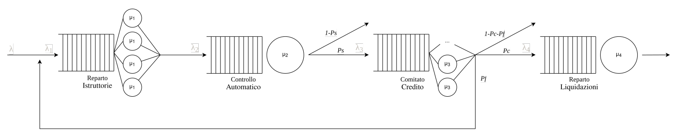

# Loan Process Performance Simulation

Simulation project focused on **analyzing and improving the performance of a real-world loan approval process** using queueing models and discrete-event simulation.

The objective was to identify bottlenecks, reduce unnecessary workload, and evaluate improvement strategies **without increasing system resources**.

---

## System Overview & Conceptual model

The loan process is modeled as a queueing network composed of:

- **Loan Application Office** – document collection and data entry (multi-server)
- **Automatic Scoring System** – fast accept/reject logic (single-server)
- **Credit Committee** – detailed manual evaluation (infinite-server)
- **Disbursement Office** – contract finalization and payment (single-server)

Each loan request is modeled as a job flowing through the system with probabilistic routing based on empirical data.

---

## Simulation

- Discrete-event simulation (next-event approach)
- Poisson arrivals and realistic service-time distributions
- Finite-horizon and steady-state simulations

Simulation results are validated against analytical queueing models (considering confidence intervals) and observed data.

**Tools**
- Java (simulation engine)
- Python (analysis and visualization)

---

## Improvement

A revised model introduces an **early pre-scoring step** to filter low-quality requests before entering costly stages.

This redesign improves system efficiency while keeping **the same staff and capacity**.

---

## Results

- Higher acceptance rate in automatic scoring (from 42% to 82%)
- ~23 human working days saved per monthimes
- No additional staff or system capacity required

---
This is the final project for the _Performance Modeling of Computer Systems_ class, University of Rome Tor Vergata (Master's Degree in Computer Engineering), September 2024.
